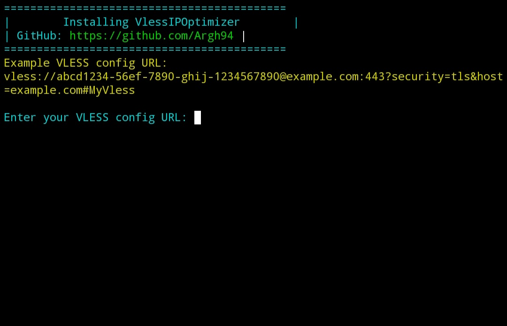

# 🌟 VlessIPOptimizer



**VlessIPOptimizer** یک ابزار قدرتمند و ساده برای اسکن آدرس‌های IPv4 و بهینه‌سازی کانفیگ VLESS است! این اسکریپت به شما کمک می‌کند تا بهترین آدرس IP را با کمترین تأخیر و نرخ از دست رفتن بسته پیدا کنید و کانفیگ VLESS خود را برای اتصالی سریع‌تر و پایدارتر بهینه کنید. طراحی شده برای اجرا در Termux، این ابزار تجربه‌ای روان و خودکار را ارائه می‌دهد.

---

## 🔥 ویژگی‌ها

- **اسکن خودکار IPv4:** صدها آدرس IP را بررسی می‌کند تا بهترین گزینه را پیدا کند.
- **بهینه‌سازی کانفیگ VLESS:** آدرس IP بهینه را به کانفیگ VLESS شما اعمال می‌کند.
- **نصب آسان:** با یک دستور ساده در Termux، همه چیز خودکار نصب و اجرا می‌شود.
- **حذف خودکار:** پس از هر اجرا، اسکریپت خود را حذف می‌کند تا همیشه نسخه جدید را دریافت کنید.
- **رابط کاربری جذاب:** نمایش رنگی و مرتب برای تجربه کاربری بهتر.
- **مناسب برای همه:** چه مبتدی باشید چه حرفه‌ای، استفاده از آن ساده است!

---

## 🛠️ پیش‌نیازها

- **Termux:** نصب‌شده روی دستگاه اندرویدی شما (از Google Play Store یا F-Droid).
- **اتصال اینترنت:** برای دانلود اسکریپت و ابزارهای مورد نیاز.
- **کانفیگ VLESS:** یک URL معتبر VLESS برای بهینه‌سازی.

---

## 🚀 نصب و اجرا

1. Termux را باز کنید.
2. دستور زیر را وارد کنید تا اسکریپت دانلود و اجرا شود:

   ```bash
   bash <(curl -fsSL https://raw.githubusercontent.com/Argh94/VlessIPOptimizer/main/install.sh)
   ```

   صبر کنید تا Termux آپدیت شود و بسته‌ها نصب شوند.

3. هنگامی که از شما خواسته شد، URL کانفیگ VLESS خود را وارد کنید (مثال):

   ```
   vless://abcd1234-56ef-7890-ghij-1234567890@example.com:443?security=tls&host=example.com#MyVless
   ```

4. اسکریپت بهترین IP را پیدا می‌کند و کانفیگ جدید VLESS را نمایش می‌دهد!

> **توجه:** اسکریپت پس از اجرا خودکار حذف می‌شود تا همیشه نسخه جدید را از مخزن دریافت کنید.

---

### 🖥️ خروجی نمونه

پس از اجرا، چیزی شبیه این خواهید دید:

```
|        Installing VlessIPOptimizer        |
| GitHub: https://github.com/Argh94        |

Example VLESS config URL:
vless://abcd1234-56ef-7890-ghij-1234567890@example.com:443?security=tls&host=example.com#MyVless
Enter your VLESS config URL:

Results Saved in result.csv

      Best IPv4:Port         *
                             *
     188.114.96.124:3581     *
      Delay: [187 ms]        *

New VLESS config: vless://abcd1234-56ef-7890-ghij-1234567890@188.114.96.124:443?security=tls&host=example.com#Powerful By @PowerSigma
```

---

## 🔒 نکات امنیتی

- **منبع خارجی:** اسکریپت ابزار `warpendpoint` را از یک منبع خارجی دانلود می‌کند. برای امنیت بیشتر، می‌توانید آن را در مخزن خود میزبانی کنید.
- **اتصال اینترنت:** مطمئن شوید دستگاه شما به اینترنت متصل است.
- **کانفیگ معتبر:** URL VLESS شما باید شامل آدرس سرور و پورت باشد.

---

## 🌐 درباره ما

- **توسعه‌دهنده:** Argh94
- **GitHub:** [https://github.com/Argh94](https://github.com/Argh94)
- **هدف:** ارائه ابزاری ساده و قدرتمند برای بهینه‌سازی اتصال VLESS!

---

## 🤝 مشارکت

آیا ایده‌ای برای بهبود دارید؟ خوشحال می‌شویم در این پروژه مشارکت کنید!

1. مخزن را فورک کنید.
2. تغییرات خود را اعمال کنید.
3. یک Pull Request ارسال کنید.

---

## 📜 مجوز

این پروژه تحت مجوز MIT منتشر شده است. جزئیات را در فایل [LICENSE](LICENSE) ببینید.

---

**VlessIPOptimizer - قدرت اتصال شما!**  
ساخته شده با ❤️ توسط Argh94
